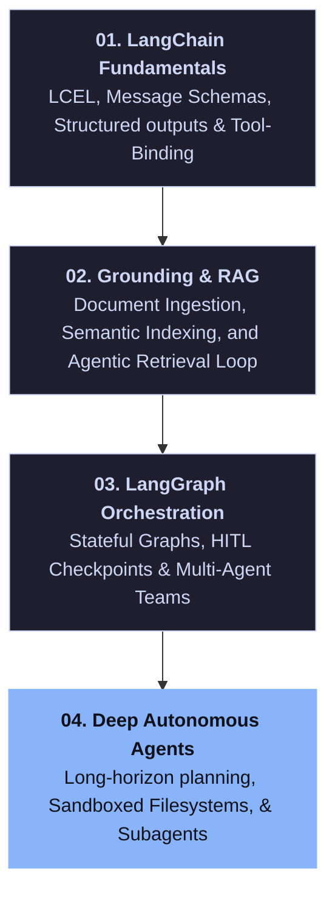
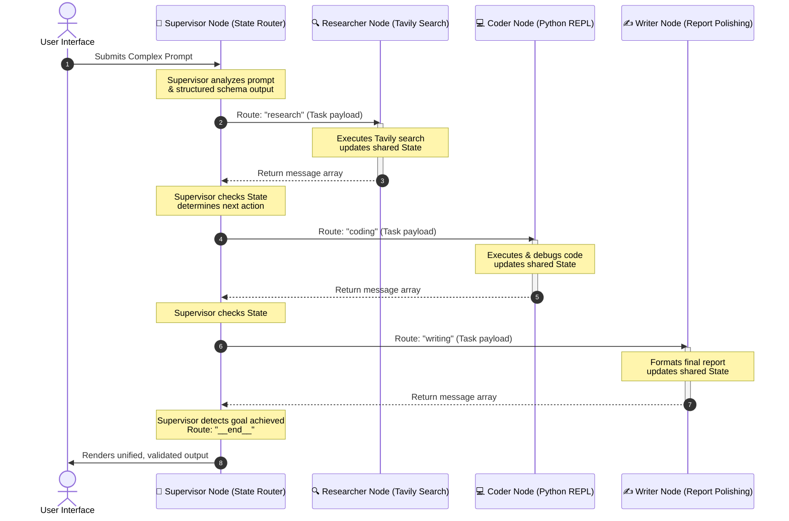

# Distributed Cognitive Agentic Systems

<!-- BADGES -->
<div align="center">

[](https://github.com/ridash2005/Agentic-AI/stargazers)
[](https://github.com/ridash2005/Agentic-AI/issues)
[](https://github.com/ridash2005/Agentic-AI/blob/main/LICENSE)
[](https://www.python.org/)

[](https://python.langchain.com/)
[](https://langchain-ai.github.io/langgraph/)
[](https://typesense.org/)

</div>

---

This repository serves as prototype for designing, implementing, and evaluating **Distributed Cognitive Agent Systems**. It moves beyond standard chat completions to construct stateful, cyclical, autonomous systems capable of dynamic planning, self-correction, tools execution, context sandboxing, and collaborative multi-agent problem solving.

---

## 🗺️ System Learning Pathway

The curriculum is structured into four progressive modules representing distinct architectural tiers. Each module builds upon the runtime abstractions established in the previous section:



---

## 🛠️ Unified Technology Stack

The engineering patterns showcased throughout this repository rely on the following enterprise-grade technologies:

* **[LangChain Core v0.3](https://python.langchain.com/)**: Standardized interface for LLM orchestration, chat model abstractions, and LangChain Expression Language (LCEL) runtime pipelines.
* **[LangGraph v0.2+](https://langchain-ai.github.io/langgraph/)**: Stateful, cyclical graph runtime for constructing multi-agent architectures, message reductions, and thread-save checkpointers.
* **[DeepAgents](https://github.com/langchain-ai/deepagents)**: Open-source agent harness designed for long-horizon task execution featuring persistent virtual filesystem sandboxes and hierarchical subagent delegation tools.
* **[Typesense Search Engine](https://typesense.org/)**: High-speed, developer-friendly search engine utilized for vector semantic search, hybrid keyword matching, and document metadata indexing.
* **[Tavily Search API](https://tavily.com/)**: Search service optimized specifically for LLMs and autonomous agents, delivering cleaned, context-rich search results.
* **[Groq Inference Engine](https://groq.com/)**: Low-latency, high-throughput model inference API executing state-of-the-art models like Qwen.
* **[Pydantic v2](https://docs.pydantic.dev/)**: Runtime data validation, structural parsing, and dynamic JSON Schema generation for reliable tool binding and output formatting.
* **[Jupyter Lab/Notebooks](https://jupyter.org/)**: Execution environment for interactive code development, visualization, and architectural testing.

---

## 📁 Repository Directory Map

```bash
Agentic AI/
│
├── 01-LangChain-Fundamentals/          # Module 1: Core Abstractions & API Gateways
│   ├── updatedlangchain/               # Notebooks: LCEL, structured JSON parsing, middleware
│   └── llm_gateway_tutorial.ipynb      # Centralized multi-provider gateway execution
│
├── 02-RAG-and-Agentic-Retrieval/       # Module 2: Grounding, Search Indexing, & Verification
│   ├── agenticrag/                     # Iterative reasoning retrieval graph nodes
│   ├── notebook/                       # Data processing, chunking strategies, & PDF loading
│   ├── src/                            # Modular Python codebase (DataLoader, Embeddings, Search)
│   ├── 1-rag_evaluation.ipynb          # Verification of faithfulness and answer relevance
│   └── typesense.ipynb                 # Semantic search server integrations
│
├── 03-LangGraph-Advanced-Workflows/    # Module 3: Cyclic State Machines & Multi-Agent Teams
│   ├── 1-BasicChatbot/                 # Stateful graphs & memory persistence
│   ├── 2-HumanAssistance/              # Interrupt gates for Human-in-the-loop (HITL) actions
│   ├── 3-Debugging/                    # Time-travel state replays & graph visual debugging
│   ├── 4-Multimodal/                   # Node orchestration for visual & binary data
│   └── Agents/                         # Supervisor router and worker agent coordination
│
├── 04-Deep-Agents-Autonomous/          # Module 4: Long-Horizon Planners & Virtual Environments
│   └── 01-basicsdeepagent.ipynb        # Sandbox execution, todo lists, & context offloading
│
└── .gitignore                          # Excludes environments, checkpoint states, and raw credentials
```

---

## 📚 Detailed Technical Module Breakdown

### 🛠️ Module 1: LangChain Fundamentals (`01-LangChain-Fundamentals`)
*Focuses on low-level client integrations, LCEL, structured serialization, and request guardrails.*
* **LCEL Runtime Abstractions (`1-langchainintro.ipynb`)**: Understanding `Runnable` interfaces, batching pipelines, and unified stream processing.
* **Model Configuration & Binding (`2-modelintegration.ipynb`)**: Dynamic prompt templating, handling system roles, and binding hyperparameter runtimes.
* **Functional Tool Mapping (`3-tools.ipynb`)**: Parsing Python docstrings and AST interfaces into JSON Schemas, allowing LLMs to trigger exact function signatures.
* **Stateful Message Formatting (`4-messages.ipynb`)**: Designing histories containing system prompts, human statements, AI responses, and precise tool execution payload returns.
* **Pydantic Structured Output Enforcement (`5-structuredoutput.ipynb`)**: Forcing LLM responses into strict JSON structures. This is critical for downstream routers and API consumers.
* **Interceptor Middleware (`6-middleware.ipynb`)**: Creating modular middleware layers that hook into standard request lifecycles to record latency, track tokens, or audit prompts.
* **Input/Output Guardrails (`langchain_guardrails_crash_course.ipynb`)**: Integrating guardrails to block prompt injection attacks and filter out hallucinations.
* **Unified API Gateways (`llm_gateway_tutorial.ipynb`)**: Building a resilient, central router that wraps multiple model providers (Anthropic, OpenAI, Google Gemini) behind a single API key and fallback routine.

---

### 🔍 Module 2: Grounding & RAG (`02-RAG-and-Agentic-Retrieval`)
*Covers text chunking, fast semantic search, quantitative verification, and recursive agentic retrieval loops.*
* **Vectorless Retrieval (`PageIndex_Vectorless_RAG_CrashCourse (1).ipynb`)**: Fetching document segments from static indexes without initializing heavy vector server infrastructures.
* **Ingestion & Token-Based Chunking (`notebook/document.ipynb`)**: Overlapping text slicing to preserve contextual integrity across document chunks.
* **PDF Structure Extraction (`notebook/pdf_loader.ipynb`)**: Processing structured PDF documents, tables, and raw text cleanup.
* **Semantic Vector Databases (`typesense.ipynb`)**: Ingesting chunk embeddings into a running **Typesense** instance for hybrid search (semantic vector + BM25 keyword matching).
* **RAG Pipeline Verification (`1-rag_evaluation.ipynb`)**: Measuring retrieval pipeline quality mathematically based on **Faithfulness** (groundedness check), **Answer Relevance** (matching user intent), and **Context Recall** (retriever performance).
* **Agentic RAG Workflows (`agenticrag/1-agenticrag.ipynb`)**: Implementing *Agentic RAG*. Rather than executing a naive one-shot database fetch, the retriever is exposed as a tool to a LangGraph node. The agent analyzes context, decides if the retrieved information is sufficient, refines queries, and performs subsequent iterations.
* **Modular Production Architecture (`src/` & `app.py`)**: A decoupled, production-ready codebase split into modular services:
  * `data_loader.py` - Standardized document pipeline.
  * `embedding.py` - Model embedding integrations.
  * `vectorstore.py` - Database CRUD and semantic index management.
  * `search.py` - Executing advanced vector-hybrid search queries.

---

### 🕸️ Module 3: LangGraph Advanced Workflows (`03-LangGraph-Advanced-Workflows`)
*Focuses on stateful cyclic graphs, transactional checkpointers, human interruption gates, and multi-agent coordination topologies.*
* **Stateful Chatbots (`1-BasicChatbot/chatbot.ipynb`)**: Building custom cyclical graphs that route conversations and preserve graph-level memory using transactional checkpointers.
* **Human-in-the-Loop Interrupts (`2-HumanAssistance/humanintheloop.ipynb`)**: Setting up automatic graph execution pauses (`interrupt_on`). The agent pauses execution before sensitive steps (e.g., file system modifications or external tool calls), prompts a human user for verification or modification, and resumes with new instructions.
* **Graph Traversal & Debugging (`3-Debugging/debugging.ipynb`)**: Time-traveling through state checkpoints. You can retrieve history threads, view how variables mutate across nodes, inject state modifications, and debug complex routing edges.
* **Multimodal Agents (`4-Multimodal/1-multimodalopenai.ipynb`)**: Designing graph nodes capable of parsing visual data arrays (images, schemas, diagrams) and integrating them into decision-making nodes.
* **Supervisor & Worker Agents (`Agents/multiaiagent.ipynb`)**: Constructing advanced multi-agent orchestrations. A central *Supervisor* decomposes complex tasks into sub-tasks and delegates them to specialized workers (e.g., Researcher, Coder, Writer) with isolated memory spaces, and then compiles the output.

---

### 🤖 Module 4: Deep Autonomous Agents (`04-Deep-Agents-Autonomous`)
*Covers long-horizon planning, filesystem sandboxing, and context management.*
* **Planning, Filesystems, & Subagents (`01-basicsdeepagent.ipynb`)**: Interfacing with the `deepagents` harness. You will explore how to manage long-horizon execution loops where an LLM is given:
  1. **Planning States (`write_todos`/`read_todos`)**: Dynamic task tracking where the agent continuously refines its checklist based on runtime outcomes.
  2. **Sandbox Environments (Filesystem Backends)**: Exposing file operation tools (`ls`, `read_file`, `write_file`, `edit_file`, `glob`, `grep`) to the agent, enabling it to write, compile, edit code, and save outputs.
  3. **Hierarchical Subagent Delegation (`task()`)**: Spawning micro-agents with dedicated, context-isolated system prompts, offloading large data arrays, and preventing context window bloat.

---

## ⚡ Prerequisites & Environmental Setup

Follow these exact steps to set up your environment:

### 1. Clone the Repository
```bash
git clone https://github.com/ridash2005/Agentic-AI.git
cd "Agentic AI"
```

### 2. Configure Virtual Environment & Dependencies
We recommend Python `3.10+` to ensure complete library compatibility:

```bash
# Initialize Python Virtual Environment
python -m venv .venv

# Activate the environment (Windows PowerShell)
.venv\Scripts\Activate.ps1

# Activate the environment (macOS/Linux)
# source .venv/bin/activate

# Install core packages
pip install --upgrade pip
pip install -r 01-LangChain-Fundamentals/requirements.txt
pip install -r 02-RAG-and-Agentic-Retrieval/requirements.txt
pip install -r 03-LangGraph-Advanced-Workflows/requirements.txt
```

### 3. Setup Environment Variables
Create a `.env` file at the root of the repository:
```env
OPENAI_API_KEY=your_openai_api_key
ANTHROPIC_API_KEY=your_anthropic_api_key
GROQ_API_KEY=your_groq_api_key
TAVILY_API_KEY=your_tavily_search_api_key
TYPESENSE_API_KEY=your_typesense_key
```

---

## 🎨 Visualizing Multi-Agent Supervision Loops
In **Module 3 (LangGraph)**, you will construct a Supervisor agent workflow. The following diagram shows how state transitions, message reductions (`Annotated[list, add_messages]`), and conditional routing edges operate:



---

## 🤝 Contributing & Support
If you find this curriculum helpful, please support the project by leaving a **Star ⭐** on the repository! For bug fixes or notebook extensions, feel free to open a Pull Request or create an Issue.

**Mantained by Rickarya Das**
